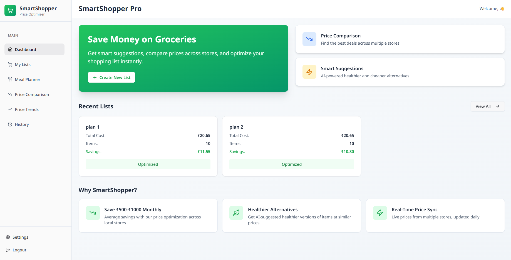
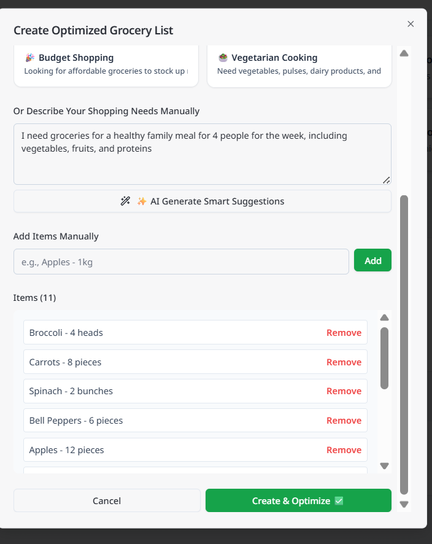
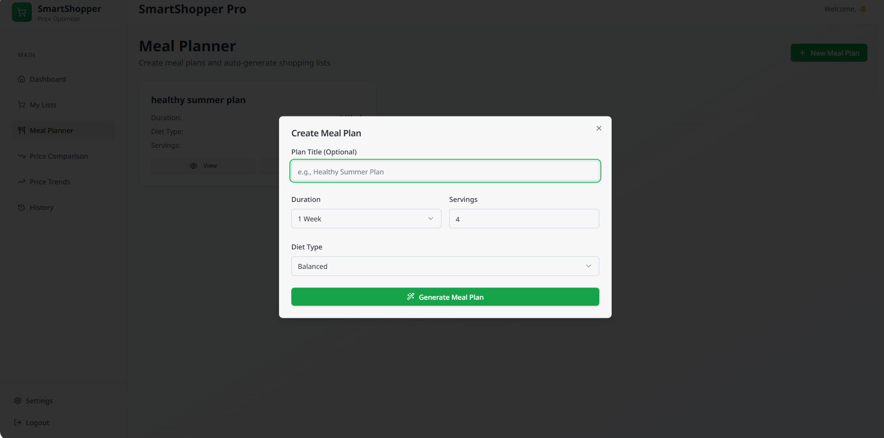
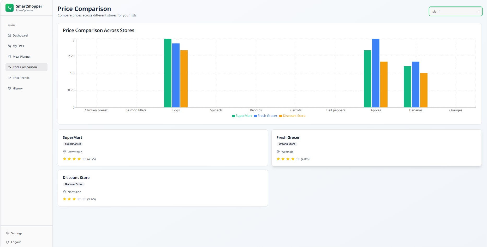

# 🛒 Smart Grocery List Generator with Price Optimization

## 📌 Product Overview
The Smart Grocery List Generator is an intelligent shopping assistant designed to help users create optimized grocery lists based on cost efficiency and item preferences. The system analyzes user input and generates a structured shopping list that aims to minimize overall expense while maintaining required items.

Built using a no-code AI development platform, this application focuses on simplifying grocery planning and improving budget-conscious decision-making through an intuitive web interface.

---

## ✨ Key Features

- 🧾 Dynamic grocery list generation based on user input  
- 💰 Price-optimized suggestions for cost efficiency  
- 🛍 Smart grouping of grocery items  
- ⚡ Instant list generation through web interface  
- 📱 Clean and user-friendly UI  
- ☁ Cloud-hosted deployment for easy access  

---

## 📸 Screenshots

### 🟢 Dashboard

### 🛒 My List

### 🍽 Meal Planner

### 💰 Price Comparison

## 🧠 Core Functionality

- Accepts user grocery requirements  
- Processes inputs using BuildAI logic engine  
- Generates optimized shopping list output  
- Suggests cost-efficient purchasing structure  

---

## 🛠 Tech Stack

- BuildAI.space (No-code AI application platform)  
- Web-based UI generation system  
- Cloud-hosted deployment via BuildAI  

---

## 🌐 Live Demo

👉https://smart-shopper-pro-copy-bceec61e.buildaispace.app

---

## 📂 Repository Purpose

This repository serves as a documentation and showcase of the Smart Grocery List Generator project, including its functionality, features, and live deployment.

---

## 📌 Project Type

No-code AI-powered web application

---

## 📈 Impact

- Helps users reduce grocery shopping costs  
- Improves decision-making through optimized suggestions  
- Simplifies grocery planning process  
- Demonstrates practical application of AI-driven no-code tools  

---

## 🔮 Future Enhancements

- Integration with real-time supermarket pricing APIs  
- Budget tracking and analytics dashboard  
- User preference-based recommendation engine  
- Mobile app version for on-the-go usage  
